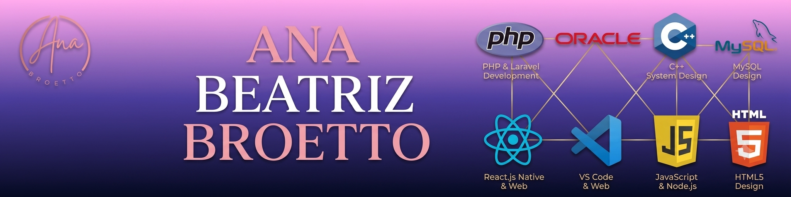

## Hello, my name is Ana Beatriz Bento Broetto👋💕

- 🔭 Sou Desenvoledora Full-Stack e  Web design;
- 🌱 Estudando Html, Css, Javascript, Php, Mysql e Oracle.
- 📫 Contate-me no email: anabeatrizbroetto@gmail.com
- ⚡ Curiosidades sobre mim: Eu sou Ana Beatriz, estudante de Tecnologia da Informação na Universidade Federal de Mato Grosso do Sul (UFMS) e recentemente aprovada no curso de Desenvolvimento de Sistemas pelo Senac Hub Academy. Sou desenvolvedora com atuação Full-Stack, focada na construção de aplicações web completas e eficientes.
Durante meu estágio, trabalhei com construção de interfaces responsivas utilizando HTML, CSS e JavaScript, além de atuar na integração com back-end usando PHP e consumo de APIs com JSON. Também possuo experiência com bancos de dados como MySQL e Oracle, realizando conexões e manipulação de dados.
Tenho perfil proativo, facilidade de aprendizado e estou em constante evolução técnica, buscando aprimorar minhas habilidades para desenvolver soluções completas, eficientes e centradas na experiência do usuário.

Estou sempre em busca de novos desafios e oportunidades de aprendizado que me permitam aprimorar minhas competências e contribuir de maneira significativa para projetos inovadores. Com uma abordagem proativa e dedicada, estou comprometida em desenvolver soluções que não apenas atendam às necessidades dos usuários, mas também proporcionem uma experiência excepcional.

Se você está procurando alguém motivado e capacitado para integrar sua equipe ou colaborar em projetos desafiadores, ficarei muito feliz em conectar e explorar oportunidades juntos!

<!--redes sociais-->
  
 
  
  
   

  
   

  <h1>Principais Linguagens Utilizadas👾❤</h1>

<!--metricas e graficos de desempenho-->

 

<!--icons principais linguagens usadas-->

 

  
  
  
  

 

 
 
<!--principais linguagens usadas com o nome-->
  
 
  
    
    
    
     
      
      
  

   

  <!--principais ferramentas de design utilizadas.-->
  

    <h1>Principais Ferramentas De Design Utilizadas😍🐾</h1>
    
     
  

   
   

  <h1>Projetos Design Web🌈🌟</h1>
   
    <h3> 💻​ Portfólio Ana Beatriz Bento Broetto 💻 </h3>
  

    
  

   
   
    <h3>🍦 Site Ice Cream World: 🍦 </h3>
  

    
  

   
    <h3>🍦 Protótipo Ice Cream World: 🍦 </h3>
  

    
  

  
   
    <h3>🔧 Site Portfólio Elton Monteiro Broetto (Design Figma): 🔧 </h3>
  

    
  

   
  <h3>🔧Portfólio Elton Monteiro Broetto (Site): 🔧 </h3>
  

    
  

  

  <picture>
  <source media="(prefers-color-scheme: dark)" srcset="https://raw.githubusercontent.com/Ana-Beatriz12/Ana-Beatriz12/output/pacman-contribution-graph-dark.svg">
  <source media="(prefers-color-scheme: light)" srcset="https://raw.githubusercontent.com/Ana-Beatriz12/Ana-Beatriz12/output/pacman-contribution-graph.svg">
  
</picture>

###

